# ZJU-blockchain-course-2024

⬆ 可以️修改成你自己的项目名。

> 第二次作业要求（以下内容提交时可以删除）：
> 
> 去中心化房屋购买系统，参与方包括：房屋拥有者，有购买房屋需求的用户
>
> 建立一个简易的房屋出售系统，在网站中：
> - 创建一个（ERC721）合约，在合约中发行房屋集合，每个NFT代表一栋房屋。让部分用户免费领取部分房屋NFT，用于后面的测试。
> - 在网站中，用户可以出售，或者使用测试以太币购买房屋。每个用户可以： 
>  1. 用户查看自己拥有的房产列表。并可以挂单出售自己的房屋（挂单包含价格等信息）。
>  2. 用户查看所有出售中的房产，并查询一栋房产的主人，及各种挂单信息。
>  3. 用户选择支付房屋价格对应的测试以太币，购买某个其他用户出售的房产。购买后房产拥有权应当发生变化。
>  4. 平台收取手续费：在一个房产出售完成时，用户支付的部分测试以太币（=某栋房产在平台上的挂单时长（timestamp）* 固定比例 * 房产价格）应该被转入某个特定账户（如合约部署者）。
      。
> - （Bonus，如果想要完成Bonus，可以直接将功能整合进上述要求中）发行一个（ERC20）合约，允许用户将测试以太币兑换成ERC20积分，并使用ERC20积分完成购买房屋的流程。
> - 请大家专注于功能实现，网站UI美观程度不纳入评分标准，但要让用户能够舒适操作。简便起见，可以在网上找图片代表不同房产，不需要将图片上链。

**以下内容为作业仓库的README.md中需要描述的内容。请根据自己的需要进行修改并提交。**

作业提交方式为：**提交视频文件**和**仓库的链接**到指定邮箱。

## 如何运行

补充如何完整运行你的应用。

1. 在本地启动ganache应用。

2. 在 `./contracts` 中安装需要的依赖，运行如下的命令：
    ```bash
    npm install
    ```
3. 在 `./contracts` 中编译合约，运行如下的命令：
    ```bash
    npx hardhat compile
    ```
4. ...
5. ...
6. 在 `./frontend` 中安装需要的依赖，运行如下的命令：
    ```bash
    npm install
    ```
7. 在 `./frontend` 中启动前端程序，运行如下的命令：
    ```bash
    npm run start
    ```

## 功能实现分析

简单描述：项目完成了要求的哪些功能？每个功能具体是如何实现的？

建议分点列出。


#### 1.登录


## 项目运行截图

项目运行成功的关键页面和流程截图。主要包括操作流程以及和区块链交互的截图。

#### 部署与配置
部署到ganache
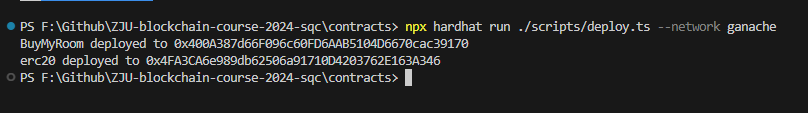

将deploy得到的地址填入`contract-addresses.json`
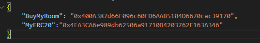

部署成功后ganache中10个账户初始状态（余额）如下图所示：
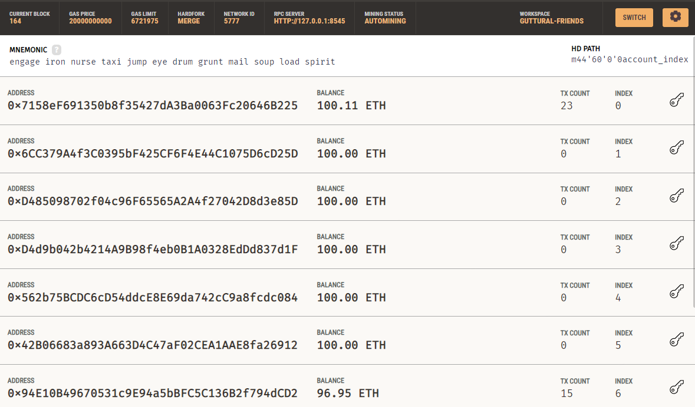
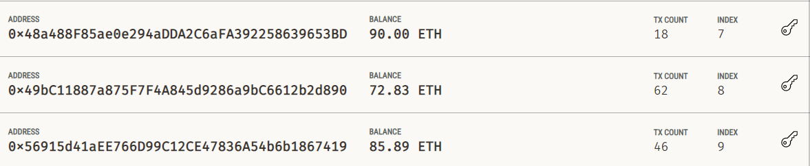

前端运行`npm start`启动

初始界面如下图所示：


点击连接钱包，会弹出metamask进行登录：
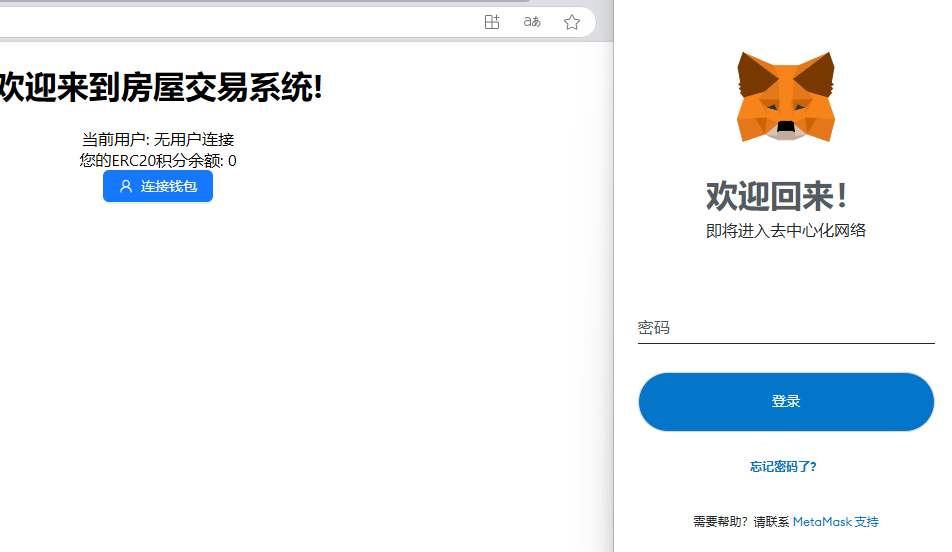

登录成功后：
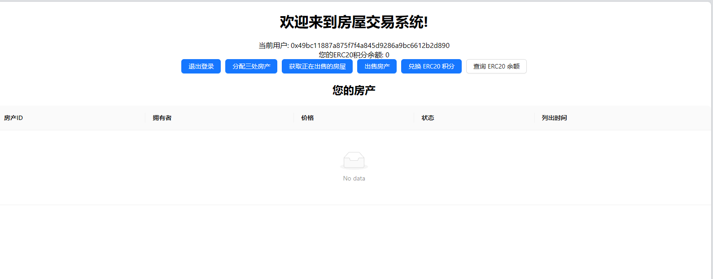

首先分配三处房产，点击“分配三处房产”，确认交易后显示：
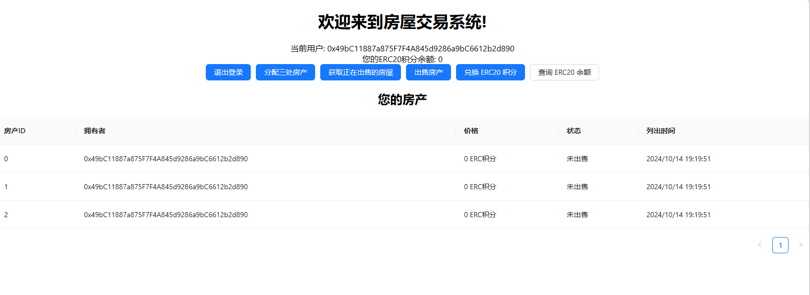

点击“获取正在出售的房屋”，当前没有任何房屋在出售状态：
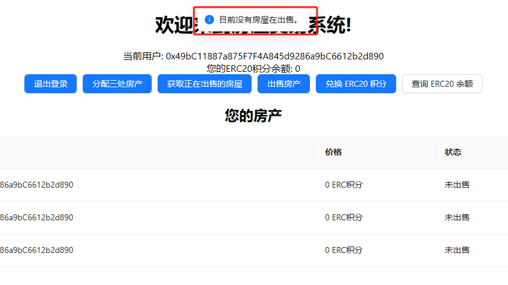

点击“出售房产”：
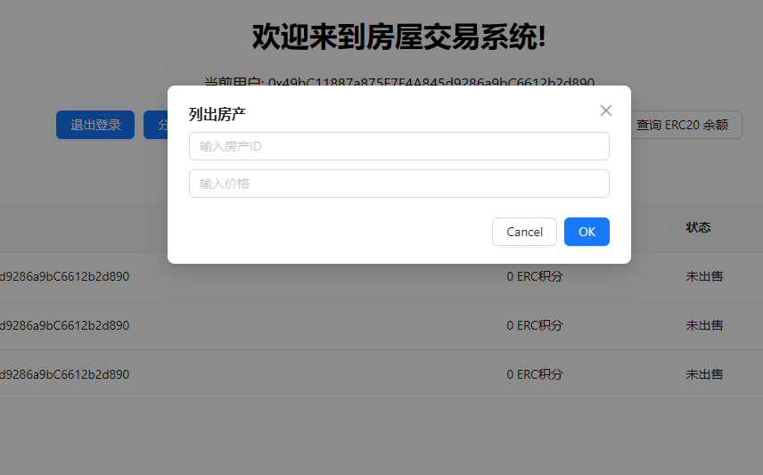

输入2（房产积分），5（价格）后，并在metamask点击确认交易，再次点击“获取正在出售的房屋”，可见ID为2的房子被添加进了出售列表：
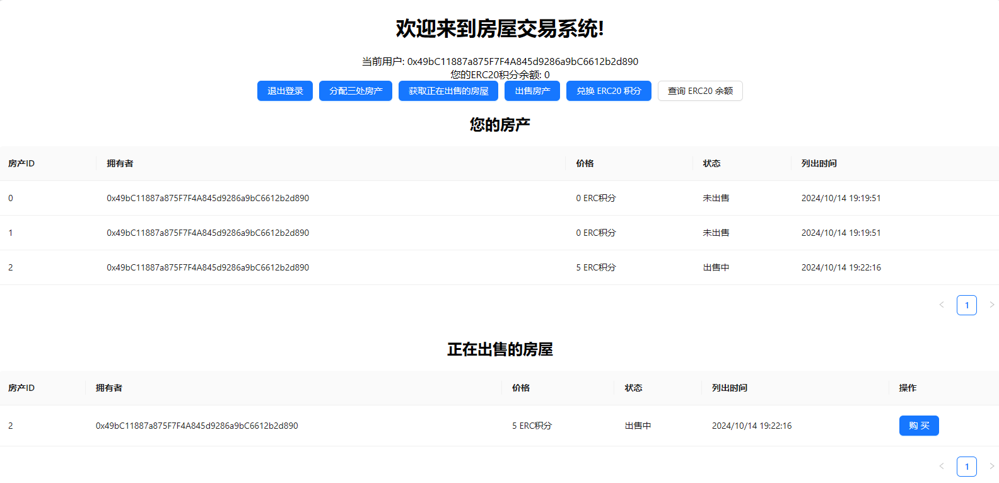


切换帐号进行购买，首先兑换ERC20积分，点击“兑换ERC20积分”按钮：
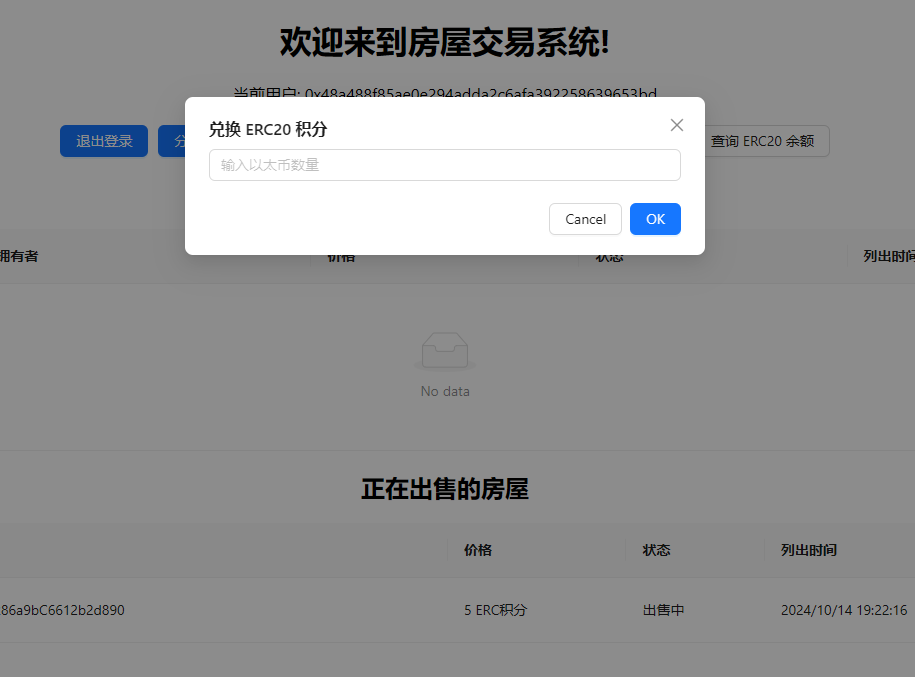

输入6个ETH，兑换6个ERC积分（1：1汇率）：
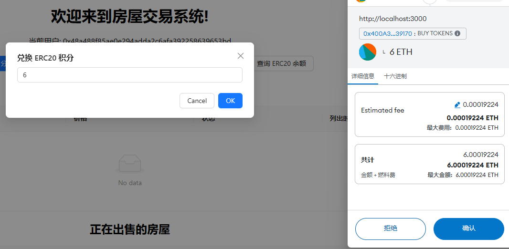
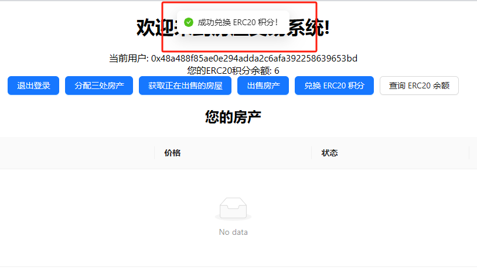

再次兑换6个ERC积分，并点击“查询ERC余额”进行查看：
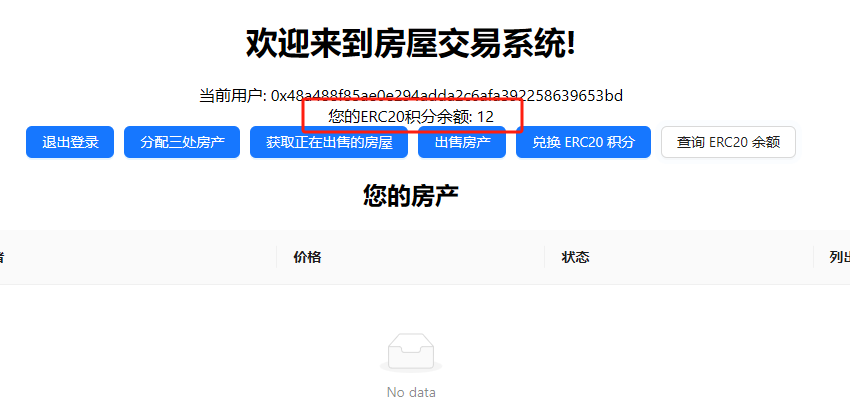

点击“购买”按钮：
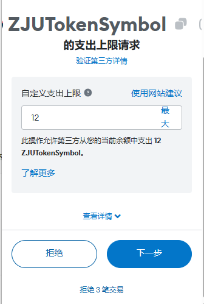

购买成功后状态如下图所示：
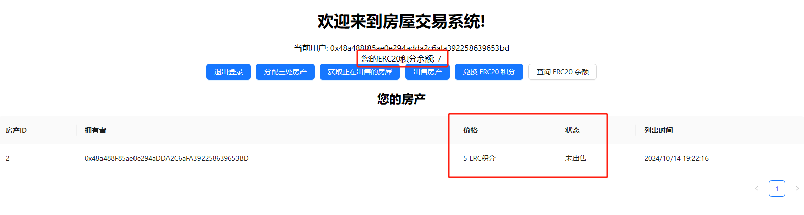

点击ganache可以查看到该用户花费了12个以太币兑换了12个ERC积分（另外还有一些手续费，它的余额从90.00ETH变成了77.99ETH）
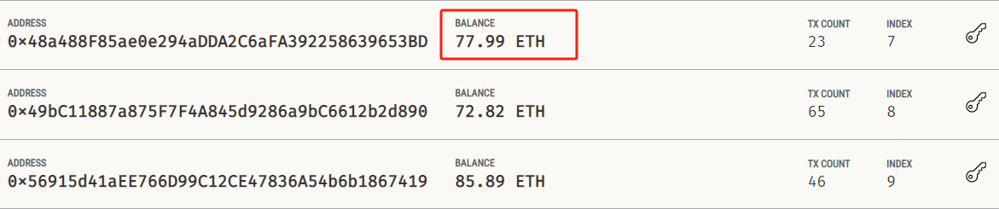

重新登录买房子的账户，可以看到获得了4.9个ERC积分（一部分用于手续费），同时该用户持有的房子从3个变成了2个。
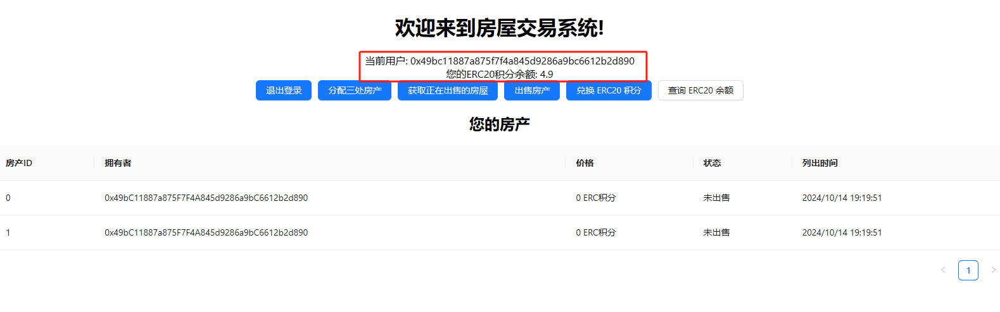

再次点击“获取正在出售的房屋”：
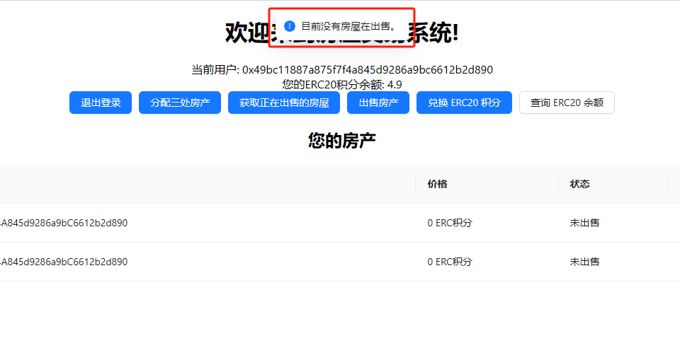

以下是在这次交易中涉及到的block（ganache中显示）：
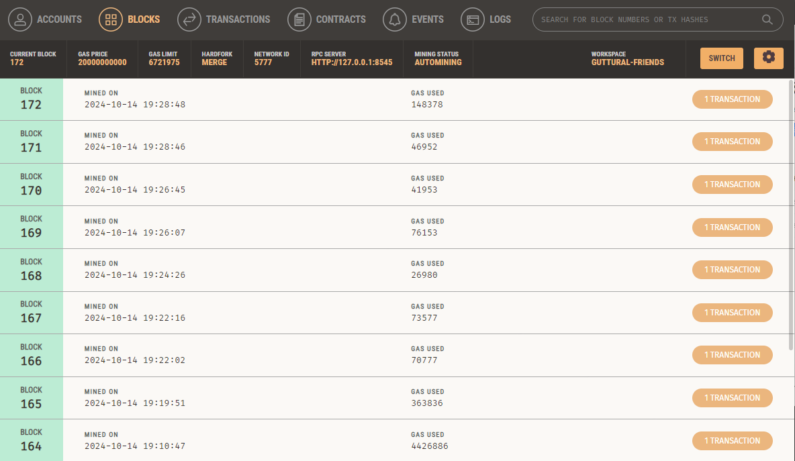

## 参考内容

- 课程的参考Demo见：[DEMOs](https://github.com/LBruyne/blockchain-course-demos)。

- 快速实现 ERC721 和 ERC20：[模版](https://wizard.openzeppelin.com/#erc20)。记得安装相关依赖 ``"@openzeppelin/contracts": "^5.0.0"``。

- 如何实现ETH和ERC20的兑换？ [参考讲解](https://www.wtf.academy/en/docs/solidity-103/DEX/)

如果有其它参考的内容，也请在这里陈列。
