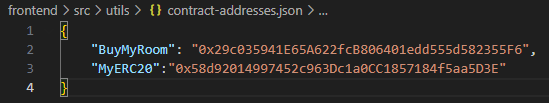
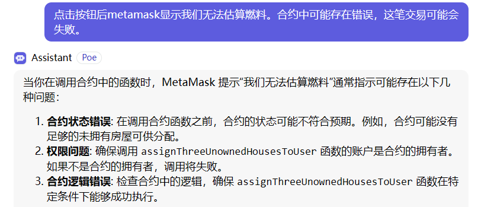
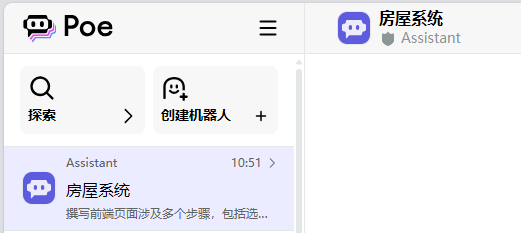

# ZJU-blockchain-course-2024

⬆ 可以️修改成你自己的项目名。

> 第二次作业要求（以下内容提交时可以删除）：
> 
> 去中心化房屋购买系统，参与方包括：房屋拥有者，有购买房屋需求的用户
>
> 建立一个简易的房屋出售系统，在网站中：
> - 创建一个（ERC721）合约，在合约中发行房屋集合，每个NFT代表一栋房屋。让部分用户免费领取部分房屋NFT，用于后面的测试。
> - 在网站中，用户可以出售，或者使用测试以太币购买房屋。每个用户可以： 
>  1. 用户查看自己拥有的房产列表。并可以挂单出售自己的房屋（挂单包含价格等信息）。
>  2. 用户查看所有出售中的房产，并查询一栋房产的主人，及各种挂单信息。
>  3. 用户选择支付房屋价格对应的测试以太币，购买某个其他用户出售的房产。购买后房产拥有权应当发生变化。
>  4. 平台收取手续费：在一个房产出售完成时，用户支付的部分测试以太币（=某栋房产在平台上的挂单时长（timestamp）* 固定比例 * 房产价格）应该被转入某个特定账户（如合约部署者）。
      。
> - （Bonus，如果想要完成Bonus，可以直接将功能整合进上述要求中）发行一个（ERC20）合约，允许用户将测试以太币兑换成ERC20积分，并使用ERC20积分完成购买房屋的流程。
> - 请大家专注于功能实现，网站UI美观程度不纳入评分标准，但要让用户能够舒适操作。简便起见，可以在网上找图片代表不同房产，不需要将图片上链。

**以下内容为作业仓库的README.md中需要描述的内容。请根据自己的需要进行修改并提交。**

作业提交方式为：**提交视频文件**和**仓库的链接**到指定邮箱。

## 如何运行

如何完整运行我的应用。

1. 在本地启动ganache应用。

2. 在 `./contracts` 中安装需要的依赖，运行如下的命令：
    ```bash
    npm install
    ```
3. 在 `./contracts` 中编译合约，运行如下的命令：
    ```bash
    npx hardhat compile
    ```
4. 部署到ganache，运行如下命令：
    `npx hardhat run ./scripts/deploy.ts --network ganache`
    
    
5. 将deploy得到的地址填入`contract-addresses.json`
    
6. 在 `./frontend` 中安装需要的依赖，运行如下的命令：
    ```bash
    npm install
    ```
7. 在 `./frontend` 中启动前端程序，运行如下的命令：
    ```bash
    npm run start
    ```

## 功能实现分析

简单描述：项目完成了要求的哪些功能？每个功能具体是如何实现的？


#### 1.登录和钱包连接
登录和钱包连接的逻辑主要通过状态管理和一系列函数实现。首先，组件使用 useState 钩子管理 `account、loading、loadingHouses、erc20Balance` 等状态。用户连接钱包的逻辑在 `handleConnectWallet` 函数中处理，检查 `MetaMask` 是否存在，并请求用户连接钱包，成功后获取用户地址并调用 `fetchUserHouses` 获取房屋信息。在组件挂载时，通过 `useEffect` 钩子检查是否已有连接的账户，若有，则设置账户状态并获取房屋信息。同时用户可以通过 `handleLogout` 函数**退出连接**，重置相关状态并显示成功消息。

#### 2.分配三处房产
用户点击“分配三处房产”按钮触发 onClaimTokenAirdrop 函数。首先检查用户是否已连接钱包。如果未连接，则提示用户连接钱包。成功连接后，调用合约的 `assignThreeUnownedHousesToUser` 方法进行房产分配。该方法在合约中检查用户是否已经领取过房产，若没有，则铸造三处新房产并将其分配给用户，同时更新状态 `claimedAirdropPlayerList[msg.sender] = true;`以避免重复领取。如果操作成功，用户会收到确认消息，并通过页面刷新显示他们的新房产信息。
其中房屋信息通过以下结构体存储：
```sol
struct House {
        uint256 tokenId;         // 房屋ID
        address owner;           // 房屋拥有者地址
        uint256 listedTimestamp; // 列出时间戳
        bool isForSale;         // 是否在出售
        uint256 price;          // 出售价格
    }

    // 存储房屋信息的映射，房屋ID到房屋信息的映射
    mapping(uint256 => House) public houses;
```

#### 3.获取正在出售的房屋
用户点击“获取正在出售的房屋”按钮来调用 `fetchForSaleHouses 函数`。该函数会向合约中的 `getAllForSaleHouses` 方法发起请求，获取所有当前在出售的房屋信息。合约通过遍历存储的房屋数据，筛选出状态为“出售中”的房屋，并返回其详细信息。在前端，成功获取数据后，房屋信息将以表格的形式展示，用户可以看到每处房产的ID、拥有者、价格及状态等信息。若没有房屋在出售，系统会提示用户。目前没有房屋在出售。

#### 4.出售房屋
用户点击“出售房产”按钮，触发一个模态框，输入房产ID和价格后，调用 `handleListHouse` 函数。该函数首先验证用户输入的有效性，然后将房产ID和价格转换为合约所需的格式，通过调用合约的 `listHouse` 方法将房屋标记为出售`houses[tokenId].isForSale = true;`。在合约中，`listHouse` 函数会检查房屋的拥有者和价格的有效性，更新房屋的状态为“出售中”，并记录挂单时间。成功执行后，用户会收到确认消息，房屋状态更新为出售。

#### 5.兑换ERC20积分
用户点击“兑换 ERC20 积分”按钮，打开模态框并输入以太币数量，触发 `buyTokens` 函数。该函数首先验证用户输入的有效性，然后调用合约的 `buyTokens` 方法，将用户发送的以太币转换为 ERC20 积分。在合约中，`buyTokens` 函数接收以太币并铸造相应数量的 ERC20 代币给用户`rewardtoken.mint(msg.sender, tokensToMint);`，同时确保用户发送的以太币大于零。交易成功后，用户会收到确认消息，并且前端会刷新 ERC20 积分余额以显示最新的积分数量。

#### 6.查询ERC20积分余额
用户点击“查询 ERC20 余额”按钮，触发 `handleCheckErc20Balance` 函数。该函数首先检查用户是否已连接钱包，如果未连接，则提示用户连接钱包。成功连接后，调用合约的 `getUserTokenBalance` 方法获取当前用户的 ERC20 积分余额。在合约中，该方法返回调用者的积分余额。前端在成功获取余额后，在页面上反馈用户的当前积分状态。

#### 7.购买房屋
用户点击“购买”按钮，触发 `buyHouse` 函数，该函数接收房屋的 `tokenId` 和价格作为参数。该函数首先检查用户是否已连接钱包，并验证房屋是否在出售。成功后，调用合约的 `buyHouse` 方法，传入房屋的 `tokenId`。在合约中，`buyHouse` 函数会确认房屋出售状态，计算应支付的手续费和净价格，然后通过 ERC20 代币转账将手续费和房屋价格分别支付给合约拥有者和原房屋拥有者。房屋的所有权会被转移给购买者`houses[tokenId].owner = msg.sender;`，同时更新房屋状态为“未出售”`houses[tokenId].isForSale = false;`。交易成功后，前端会刷新用户的房屋信息和 ERC20 积分余额，并显示购买成功的消息。


## 项目运行截图

项目运行成功的关键页面和流程截图。主要包括操作流程以及和区块链交互的截图。

#### 部署与配置
部署到ganache


将deploy得到的地址填入`contract-addresses.json`


部署成功后ganache中10个账户初始状态（余额）如下图所示：


前端运行`npm start`启动

#### 整体运行流程

初始界面如下图所示：


点击连接钱包，会弹出metamask进行登录：


登录成功后：


首先分配三处房产，点击“分配三处房产”，确认交易后显示：


点击“获取正在出售的房屋”，当前没有任何房屋在出售状态：


点击“出售房产”：


输入2（房产积分），5（价格）后，并在metamask点击确认交易，再次点击“获取正在出售的房屋”，可见ID为2的房子被添加进了出售列表：


切换帐号进行购买，首先兑换ERC20积分，点击“兑换ERC20积分”按钮：


输入6个ETH，兑换6个ERC积分（1：1汇率）：


再次兑换6个ERC积分，并点击“查询ERC余额”进行查看：


点击“购买”按钮：


购买成功后状态如下图所示：


点击ganache可以查看到该用户花费了12个以太币兑换了12个ERC积分（另外还有一些手续费，它的余额从90.00ETH变成了77.99ETH）


重新登录买房子的账户，可以看到获得了4.9个ERC积分（一部分用于手续费），同时该用户持有的房子从3个变成了2个。


再次点击“获取正在出售的房屋”：


以下是在这次交易中涉及到的block（ganache中显示）：


## 参考内容

- 课程的参考Demo见：[DEMOs](https://github.com/LBruyne/blockchain-course-demos)。

- 快速实现 ERC721 和 ERC20：[模版](https://wizard.openzeppelin.com/#erc20)。记得安装相关依赖 ``"@openzeppelin/contracts": "^5.0.0"``。

- 如何实现ETH和ERC20的兑换？ [参考讲解](https://www.wtf.academy/en/docs/solidity-103/DEX/)

- metamask如何自定义网络连接ganache [参考链接](https://blog.csdn.net/sanqima/article/details/120406660)

- 合约中的相关操作（如变量的控制与选取）[参考链接](https://www.wtf.academy/docs/solidity-101/DataStorage/)

- 合约教程参考 [参考链接1](https://learnblockchain.cn/docs/solidity/introduction-to-smart-contracts.html) [参考链接2](https://blog.csdn.net/a6taotao/article/details/112602580?ops_request_misc=%257B%2522request%255Fid%2522%253A%2522163BA0B1-4EE0-4511-A8A0-E956130ED36B%2522%252C%2522scm%2522%253A%252220140713.130102334..%2522%257D&request_id=163BA0B1-4EE0-4511-A8A0-E956130ED36B&biz_id=0&utm_medium=distribute.pc_search_result.none-task-blog-2~all~top_positive~default-1-112602580-null-null.142^v100^pc_search_result_base9&utm_term=%E6%99%BA%E8%83%BD%E5%90%88%E7%BA%A6&spm=1018.2226.3001.4187)

- 部分合约的错误修正通过assistant助手找出,例如列出出售中房屋时写错了变量导致死循环: [参考链接poe.com](https://poe.com/)
    ```sol
    for (uint256 i = 0; a(一个用于调试的变量，后删除) < 3; i++) {
           ……
        }
    ```
    


- 前端代码的学习与参考 [参考链接v0大模型](https://v0.dev/chat/cMU2ZE1Z5lj) 以及kimi大模型、assistant大模型
    


